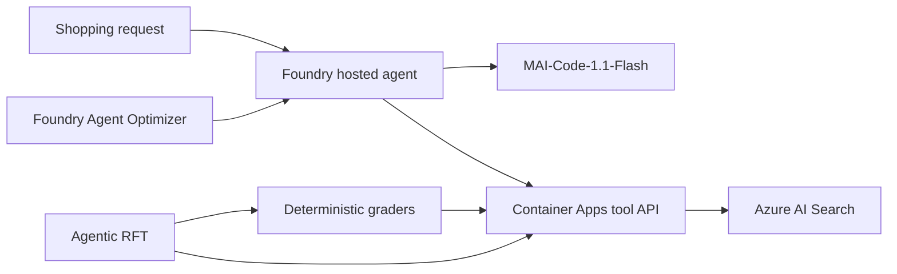

# ShoppingBench on Microsoft Foundry

[](https://github.com/AliciaFrame/shoppingbench-foundry/actions/workflows/ci.yml)

An end-to-end, reproducible demo of improving tool-using shopping agents with
deterministic evaluation, Microsoft Foundry Agent Optimizer, and agentic
reinforcement fine-tuning (RFT).

This repository packages four ShoppingBench task families as hosted agents
powered by MAI-Code-1.1-Flash. It includes the Azure tool runtime, controlled
product corpus, agent configurations, fixed evaluation splits, raw experiment
receipts, optimization workflows, and RFT submission code.

## What the benchmark tests

| Task | Agent must | Why it matters |
|---|---|---|
| **Product** | Find one item satisfying title, price, service, SKU, and attribute constraints | Tests precise retrieval, inspection, and constraint satisfaction |
| **Shop** | Find several requested products sold by the same shop | Tests multi-item planning and a cross-product invariant |
| **Voucher** | Select products that satisfy voucher threshold, discount, shop scope, and final budget | Tests tool use plus arithmetic and policy constraints |
| **Web** | Resolve a factual clue, use it to search, inspect the result, and recommend the matching product | Tests knowledge-to-action grounding rather than answer-only recall |

The agent interacts through four tools:

1. `find_product` searches the product index.
2. `view_product_information` inspects full details.
3. `recommend_product` submits ordered product IDs.
4. `terminate` explicitly closes the episode.

These tasks are useful because a fluent final answer is not enough. The agent
must retrieve the right objects, inspect evidence, preserve ordering, satisfy
task-specific invariants, and follow a reliable tool protocol.

## Architecture



See [docs/architecture.md](docs/architecture.md) for component and data-flow
details. See [docs/reproducibility.md](docs/reproducibility.md) for the
clean-clone verification path and the complete cloud rerun sequence.

## Historical v1 measured results

These are the original published v1 results. The 50-case sets were excluded
from training, but they were reused for candidate and checkpoint selection and
therefore functioned as development sets rather than sealed final tests. Web
also contained three holdout cases whose target product IDs appeared in RFT
training. See the
[v1 methodology audit](docs/audits/v1-methodology-audit.md) and immutable
[evidence manifest](docs/audits/v1-evidence-manifest.json).

| Task | Initial canonical | Final canonical | Final success | Final termination | Retained change |
|---|---:|---:|---:|---:|---|
| Product | 0.753 | **0.961** | 48/50 | 49/50 | Tool definitions |
| Shop | 0.860 | **0.998** | 49/50 | 50/50 | Instructions + tool definitions |
| Voucher | 0.898 | **0.995** | 49/50 | 49/50 | RFT Step 12 checkpoint |
| Web | 0.790 | **0.901** | 44/50 | 47/50 | RFT Step 10 checkpoint |

Under the v1 scoring contract, the mean canonical score increased from
approximately **0.825 to 0.964**.
Agent Optimizer supplied the retained improvement for Product and Shop and
established the Voucher policy used for training. Agentic RFT supplied the
final bridge for both Voucher (`0.955` to `0.995`) and Web (`0.790` to
`0.901`).

The Web RFT result came from checkpoint selection, not blindly deploying the
final artifact:

| Web model | Canonical score | Exact product | Perfect | Terminated |
|---|---:|---:|---:|---:|
| Base model + retained agent | 0.790 | 38/50 | 32/50 | 40/50 |
| RFT Step 10 | **0.901** | **44/50** | **43/50** | **47/50** |
| RFT Step 15 | 0.836 | 40/50 | 40/50 | 46/50 |
| RFT final | 0.795 | 39/50 | 36/50 | 40/50 |

The later checkpoints regressed, demonstrating why checkpoint evaluation is a
required part of the workflow. The tracked comparison receipt is
[`rft/results/web-rft3-holdout-comparison.json`](rft/results/web-rft3-holdout-comparison.json).

Voucher showed the complementary outcome: Step 12 improved 24 cases, tied 26,
and regressed none under the v1 aggregate score. Exact selection improved from
46/50 to 49/50, while termination improved from 29/50 to 49/50, so most of the
measured gain was protocol completion rather than demonstrated arithmetic
reasoning. The tracked comparison is
[`rft/results/voucher-rft1-holdout-comparison.json`](rft/results/voucher-rft1-holdout-comparison.json).

A final Agent Optimizer pass around Web Step 10 also stopped at the
deterministic gate. Its nominated system-prompt candidate raised the optimizer
judge from `0.584625` to `0.5885` and reduced token use, but canonical quality
fell from `0.901` to `0.871` and exact selection from 44/50 to 41/50. Step 10
with the retained agent configuration remains final.

## Current v2 remediation evidence

All four retained task configurations have now been evaluated on their
leakage-safe 30-case development splits with three rollouts per case, the final
sequential tool protocol, and a 12-step bound. These are model-selection
results, not sealed final-test estimates.

| Task/artifact | Mean | Exact | Success | Valid final answer |
|---|---:|---:|---:|---:|
| Product retained agent | 0.9408 | 84/90 | 74/90 | 87/90 |
| Shop retained agent | 0.9371 | 84/90 | 84/90 | 85/90 |
| Voucher v3 Step 10 | 0.9248 | 83/90 | 78/90 | 78/90 |
| **Web historical Step 10 (selected)** | **0.7347** | **64/90** | **61/90** | **64/90** |

Web Step 10's mean and exact-selection changes versus the base model were
inconclusive, but it materially improved complete success (`31/90` to `61/90`)
and reduced mean token use from 97,156 to 59,853. A new grader-v3 Web RFT
experiment completed, but all three deployable checkpoints regressed:

| Web RFT4 artifact | Mean | Exact | Success | Mean tokens |
|---|---:|---:|---:|---:|
| Step 6 | 0.6500 | 59/90 | 45/90 | 68,757 |
| Step 9 | 0.6717 | 60/90 | 54/90 | 79,135 |
| Final/Step 12 | 0.6669 | 59/90 | 57/90 | 88,009 |

Relative to retained Step 10, every RFT4 artifact had a lower mean, fewer
exact selections and complete successes, higher token use, and higher latency.
The retained historical Step 10 therefore remains the frozen Web operating
point; no hosted-agent redeployment was made.

### Sealed final-test results

After every model, prompt, skill, tool, grader, and checkpoint choice was
frozen, each disjoint 50-case final-test split was opened exactly once:

| Task | Mean | Exact | Success | Valid final answer | Mean tokens |
|---|---:|---:|---:|---:|---:|
| Product | **0.9385** | 46/50 | 46/50 | 49/50 | 11,975 |
| Shop | **0.9047** | 45/50 | 44/50 | 45/50 | 34,917 |
| Voucher | **0.8625** | 43/50 | 40/50 | 41/50 | 31,349 |
| Web | **0.6305** | 32/50 | 20/50 | 20/50 | 64,083 |

Shop includes one malformed-ID tool failure scored as zero. Voucher includes
one malformed-ID tool failure and one Azure content-filter rejection, both
scored as zero. None was rerolled. Web's lower sealed result confirms that
knowledge-to-search generalization remains the principal unresolved
bottleneck; the final results were not used to launch another optimization or
training round.

### Voucher checkpoint selection

| Voucher artifact | Mean | Exact | Success | Valid final answer | Mean tokens |
|---|---:|---:|---:|---:|---:|
| Historical Step 12 retained model | 0.9029 | 81/90 | 74/90 | 75/90 | 38,076 |
| **v3 Step 10 (selected)** | **0.9248** | 83/90 | **78/90** | **78/90** | **29,610** |
| v3 Step 15 | 0.8980 | 80/90 | 74/90 | 77/90 | 29,077 |
| v3 final | **0.9253** | **84/90** | 71/90 | 71/90 | 30,950 |

The final checkpoint's one-rollout exact advantage over Step 10 was inside the
clustered confidence interval. It also lost seven complete successes, produced
seven fewer valid final answers, used 1,340 more tokens per episode, and added
2.14 seconds of mean latency. Step 10 is therefore the selected operating
point. The direct paired receipt is
[`evaluations/results/v2/voucher-v3-final-vs-step10.json`](evaluations/results/v2/voucher-v3-final-vs-step10.json).

Raw 50-case receipts are in
[`optimization/results/raw`](optimization/results/raw), with a machine-readable
summary in
[`optimization/results/summary.json`](optimization/results/summary.json).
RFT status and results are tracked under [`rft/results`](rft/results).
Committed job JSON files are immutable submission receipts; live status files
are generated by the monitor and intentionally ignored to avoid publishing
resource-specific operational churn. The first Web receipt documents a
pre-training tool-schema validation failure. The successful `rft3` receipt
records the calibrated v2 grader,
`developerTier` training type, and exact uploaded files.

## Repository map

| Directory | Contents |
|---|---|
| [`data`](data) | Frozen public tasks, controlled search corpus, deterministic preparation |
| [`azure`](azure) | Bicep infrastructure and Container Apps tool/grader runtime |
| [`agents`](agents) | Four task entry points, retained configurations, hosted-agent manifest |
| [`evaluations`](evaluations) | Fixed datasets, canonical grader, RFT grader, evaluation runner |
| [`optimization`](optimization) | Per-task seeds, Agent Optimizer runner, raw receipts, results |
| [`rft`](rft) | Data preparation, calibration, submission, monitoring, receipts |
| [`docs`](docs) | Architecture, results interpretation, and demo walkthrough |

## Quick start

### 1. Install

```powershell
git clone https://github.com/aliciaframe/shoppingbench-foundry.git
Set-Location shoppingbench-foundry
python -m venv .venv
.\.venv\Scripts\python -m pip install -e ".[agents,dev]"
```

Copy `.env.example` to `.env` and fill only the resources you intend to use.
Use managed identity or `DefaultAzureCredential` wherever supported; do not
commit keys or bearer tokens.

### 2. Validate and regenerate local artifacts

```powershell
.\.venv\Scripts\python data\scripts\prepare.py
.\.venv\Scripts\python -m pytest
```

The default command now produces the v2 prepared corpus and connected-group
splits under `data/prepared/search-documents-v2.jsonl` and
`evaluations/datasets/v2`. Use `--version v1` only to reproduce the historical
artifacts. The prepared search corpus contains 1,818 benchmark gold products plus one
deterministic distractor per gold product (3,636 documents). This controlled
corpus supports reproducible behavior comparisons; it is intentionally smaller
than the original ShoppingBench production-scale catalog.

For expected counts, exact model checkpoints, baseline/final configuration
selection, and cloud rerun caveats, follow
[docs/reproducibility.md](docs/reproducibility.md).

### 3. Provision the Azure tool runtime

The included Bicep provisions the search, storage, observability, registry, and
Container Apps layers. A Microsoft Foundry project and an accessible
MAI-Code-1.1-Flash deployment are prerequisites supplied through environment
configuration; they are not created implicitly.

```powershell
azd auth login
azd env new shoppingbench-demo
azd env set SHOPPINGBENCH_API_TOKEN "<generated-secret>"
azd up
```

Then grant your indexing identity `Search Index Data Contributor` on the
created Azure AI Search resource and load the corpus:

```powershell
python -m shoppingbench_foundry.index_documents `
  --endpoint $env:AZURE_SEARCH_ENDPOINT `
  --documents data\prepared\search-documents-v2.jsonl
```

Full details: [azure/README.md](azure/README.md).

### 4. Deploy the four hosted agents

Configure `FOUNDRY_PROJECT_ENDPOINT`, `SHOPPINGBENCH_TOOL_URL`,
`SHOPPINGBENCH_API_TOKEN`, and each task's model pair:
`PRODUCT_*`, `SHOP_*`, `VOUCHER_*`, and `WEB_*` as shown in
`.env.example`. The task-specific values prevent a retained RFT deployment
from being applied accidentally to all four agents. Then:

```powershell
Set-Location agents
azd deploy
```

Each task has its own entry point and retained configuration under
`agents/<task>`. Full details: [agents/README.md](agents/README.md).

### 5. Evaluate, optimize, and train

- Canonical evaluation: [evaluations/README.md](evaluations/README.md)
- Agent Optimizer: [optimization/README.md](optimization/README.md)
- Agentic RFT: [rft/README.md](rft/README.md)

## Improvement mechanisms

### Agent Optimizer

Agent Optimizer improves the **agent configuration around the base model**:
instructions, tool descriptions/schemas, and skills. It does not change model
weights. Candidate selection is fast and comparatively cheap, but every
candidate must still pass the deterministic holdout.

### Reinforcement fine-tuning

Agentic RFT updates the **model policy itself** using live multi-step tool
episodes and a calibrated reward. The Web task was selected first because its
base policy failed 40% of calibration episodes at the canonical pass threshold,
providing enough learning signal. Product and Shop were held back because their
calibrated failure rates were below the signal floor. Voucher produced a 35% failure rate. Its conservative one-epoch RFT run
retained Step 12 after a no-regression canonical comparison.

## Presenting the demo

Use [docs/demo-walkthrough.md](docs/demo-walkthrough.md) for a presentation
sequence that starts with the task, runs a tool episode, explains the grader,
shows optimization evidence, and closes with the RFT experiment.

For an executive-to-technical narrative, open the standalone
[HTML slide deck](docs/shoppingbench-hill-climb-deck.html). Use the arrow keys
to navigate or print it to PDF from a browser.

For a single-slide summary that can be dropped into another presentation, use
the editable [16:9 HTML slide](docs/shoppingbench-hill-climb-summary-slide.html)
or the rendered [1600x900 PNG](docs/shoppingbench-hill-climb-summary-slide.png).

## Attribution

This project adapts [ShoppingBench](https://github.com/yjwjy/ShoppingBench)
under the Apache License 2.0. See [NOTICE](NOTICE).
