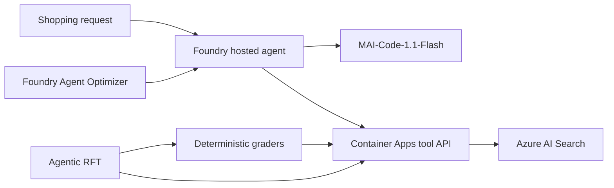

# ShoppingBench on Microsoft Foundry

An end-to-end, reproducible demo of improving tool-using shopping agents with
deterministic evaluation, Microsoft Foundry Agent Optimizer, and agentic
reinforcement fine-tuning (RFT).

This repository packages four ShoppingBench task families as hosted agents
powered by MAI-Code-1.1-Flash. It includes the Azure tool runtime, controlled
product corpus, agent configurations, fixed evaluation splits, raw experiment
receipts, optimization workflows, and RFT submission code.

## What the benchmark tests

| Task | Agent must | Why it matters |
|---|---|---|
| **Product** | Find one item satisfying title, price, service, SKU, and attribute constraints | Tests precise retrieval, inspection, and constraint satisfaction |
| **Shop** | Find several requested products sold by the same shop | Tests multi-item planning and a cross-product invariant |
| **Voucher** | Select products that satisfy voucher threshold, discount, shop scope, and final budget | Tests tool use plus arithmetic and policy constraints |
| **Web** | Resolve a factual clue, use it to search, inspect the result, and recommend the matching product | Tests knowledge-to-action grounding rather than answer-only recall |

The agent interacts through four tools:

1. `find_product` searches the product index.
2. `view_product_information` inspects full details.
3. `recommend_product` submits ordered product IDs.
4. `terminate` explicitly closes the episode.

These tasks are useful because a fluent final answer is not enough. The agent
must retrieve the right objects, inspect evidence, preserve ordering, satisfy
task-specific invariants, and follow a reliable tool protocol.

## Architecture



See [docs/architecture.md](docs/architecture.md) for component and data-flow
details.

## Measured results

All deployment decisions use untouched 50-case canonical holdouts. Agent
Optimizer's LLM-judge score nominates candidates; the deterministic holdout
decides whether a candidate is retained.

| Task | Initial canonical | Final canonical | Final success | Final termination | Retained change |
|---|---:|---:|---:|---:|---|
| Product | 0.753 | **0.961** | 48/50 | 49/50 | Tool definitions |
| Shop | 0.860 | **0.998** | 49/50 | 50/50 | Instructions + tool definitions |
| Voucher | 0.898 | **0.955** | 46/50 | 29/50 | Skills/configuration from round one |
| Web | 0.790 | **0.790** | 38/50 | 40/50 | Baseline retained |

The mean canonical score increased from approximately **0.825 to 0.926**.
Voucher round two and Web round two were not retained because their canonical
results did not improve, even though their optimizer scores increased.

Raw 50-case receipts are in
[`optimization/results/raw`](optimization/results/raw), with a machine-readable
summary in
[`optimization/results/summary.json`](optimization/results/summary.json).
RFT status and results are tracked under [`rft/results`](rft/results).

## Repository map

| Directory | Contents |
|---|---|
| [`data`](data) | Frozen public tasks, controlled search corpus, deterministic preparation |
| [`azure`](azure) | Bicep infrastructure and Container Apps tool/grader runtime |
| [`agents`](agents) | Four task entry points, retained configurations, hosted-agent manifest |
| [`evaluations`](evaluations) | Fixed datasets, canonical grader, RFT grader, evaluation runner |
| [`optimization`](optimization) | Per-task seeds, Agent Optimizer runner, raw receipts, results |
| [`rft`](rft) | Data preparation, calibration, submission, monitoring, receipts |
| [`docs`](docs) | Architecture, results interpretation, and demo walkthrough |

## Quick start

### 1. Install

```powershell
git clone https://github.com/aliciaframe/shoppingbench-foundry.git
Set-Location shoppingbench-foundry
python -m venv .venv
.\.venv\Scripts\python -m pip install -e ".[agents,dev]"
```

Copy `.env.example` to `.env` and fill only the resources you intend to use.
Use managed identity or `DefaultAzureCredential` wherever supported; do not
commit keys or bearer tokens.

### 2. Validate and regenerate local artifacts

```powershell
.\.venv\Scripts\python data\scripts\prepare.py
.\.venv\Scripts\python -m pytest
```

The prepared search corpus contains 1,818 benchmark gold products plus one
deterministic distractor per gold product (3,636 documents). This controlled
corpus supports reproducible behavior comparisons; it is intentionally smaller
than the original ShoppingBench production-scale catalog.

### 3. Provision the Azure tool runtime

The included Bicep provisions the search, storage, observability, registry, and
Container Apps layers. A Microsoft Foundry project and an accessible
MAI-Code-1.1-Flash deployment are prerequisites supplied through environment
configuration; they are not created implicitly.

```powershell
azd auth login
azd env new shoppingbench-demo
azd env set SHOPPINGBENCH_API_TOKEN "<generated-secret>"
azd up
```

Then grant your indexing identity `Search Index Data Contributor` on the
created Azure AI Search resource and load the corpus:

```powershell
python -m shoppingbench_foundry.index_documents `
  --endpoint $env:AZURE_SEARCH_ENDPOINT `
  --documents data\prepared\search-documents.jsonl
```

Full details: [azure/README.md](azure/README.md).

### 4. Deploy the four hosted agents

Configure `FOUNDRY_PROJECT_ENDPOINT`, `MAI_OPENAI_BASE_URL`,
`MAI_MODEL_DEPLOYMENT_NAME`, `SHOPPINGBENCH_TOOL_URL`, and
`SHOPPINGBENCH_API_TOKEN`, then:

```powershell
Set-Location agents
azd deploy
```

Each task has its own entry point and retained configuration under
`agents/<task>`. Full details: [agents/README.md](agents/README.md).

### 5. Evaluate, optimize, and train

- Canonical evaluation: [evaluations/README.md](evaluations/README.md)
- Agent Optimizer: [optimization/README.md](optimization/README.md)
- Agentic RFT: [rft/README.md](rft/README.md)

## Improvement mechanisms

### Agent Optimizer

Agent Optimizer improves the **agent configuration around the base model**:
instructions, tool descriptions/schemas, and skills. It does not change model
weights. Candidate selection is fast and comparatively cheap, but every
candidate must still pass the deterministic holdout.

### Reinforcement fine-tuning

Agentic RFT updates the **model policy itself** using live multi-step tool
episodes and a calibrated reward. The Web task was selected first because its
base policy failed 40% of calibration episodes at the canonical pass threshold,
providing enough learning signal. Product was held back because repeated
calibration produced only 15% failures; its curriculum needs harder cases
before training.

## Presenting the demo

Use [docs/demo-walkthrough.md](docs/demo-walkthrough.md) for a presentation
sequence that starts with the task, runs a tool episode, explains the grader,
shows optimization evidence, and closes with the RFT experiment.

## Attribution

This project adapts [ShoppingBench](https://github.com/yjwjy/ShoppingBench)
under the Apache License 2.0. See [NOTICE](NOTICE).
